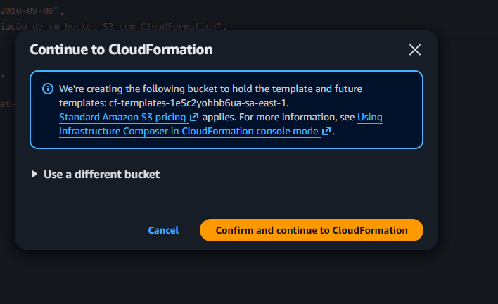

# 🧩 Executando Tarefas Automatizadas com AWS Lambda e S3

## 📖 Descrição do Projeto
Este projeto foi desenvolvido como parte do desafio **“Executando Tarefas Automatizadas com Lambda Function e S3”** da **Digital Innovation One (DIO)**.  

O objetivo é demonstrar, de forma prática, como **automatizar tarefas na nuvem utilizando AWS Lambda e Amazon S3**, integrando esses serviços para executar ações automáticas sempre que ocorrer um evento em um bucket S3.

---

## 🎯 Objetivos de Aprendizagem
Ao realizar este projeto, pude:
- Aplicar conceitos de **computação serverless** com AWS Lambda;  
- Automatizar processos com **eventos do Amazon S3**;  
- Compreender a **integração entre Lambda, S3 e IAM**;  
- Documentar o processo técnico de forma clara, estruturada e reprodutível;  
- Utilizar o **GitHub** como ferramenta de versionamento e portfólio técnico.

---

## ⚙️ Arquitetura da Solução
A automação criada segue o seguinte fluxo:

1. Um arquivo é enviado (upload) para o bucket de origem no **Amazon S3**;  
2. O **S3** dispara automaticamente um evento do tipo *“ObjectCreated”*;  
3. Esse evento aciona a **função AWS Lambda**;  
4. A função Lambda executa uma ação — neste exemplo, **copia o arquivo para outro bucket de destino**;  
5. O log da execução é registrado no **Amazon CloudWatch**.

---

## 💻 Código da Função Lambda (Python)

```python
import boto3

def lambda_handler(event, context):
    s3 = boto3.client('s3')
    
    source_bucket = event['Records'][0]['s3']['bucket']['name']
    file_key = event['Records'][0]['s3']['object']['key']
    destination_bucket = 'meu-bucket-destino'
    
    try:
        s3.copy_object(
            CopySource={'Bucket': source_bucket, 'Key': file_key},
            Bucket=destination_bucket,
            Key=file_key
        )
        print(f"Arquivo {file_key} copiado de {source_bucket} para {destination_bucket}")
    except Exception as e:
        print(f"Erro: {str(e)}")
```
testing add image


